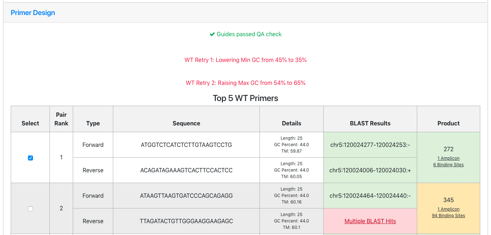

# CasCADe: a fully integrated and open source pipeline to design CRISPR mutagenesis experiments

### Hardware requirements
 - CasCADe requires a debian based Linux system with a minimum 8GB of RAM and 100GB of hard disk space. 
 - Alternately, CasCADe can be run on any Docker-compatible system (instructions to come)
### Installation instructions
  Make sure that your user account has ```sudo``` privilege before installing CasCADe.
  Run the following commands to install git.
  ```
    sudo apt-get update
    sudo apt-get install -y git apache2
  ```
  Navigate to a folder where you would like to install CasCADe (must be a folder that can be served by apache2, e.g. ```/var/www/html```, remove the index.html file if it exists, and type
  ```
    git clone https://github.com/ccmbioinfo/CasCADe.git
  ```    
  to clone the CasCADe repo.
 Then, run the installation script using the command below
 ```
    cd installation
    ./install_debian.sh <path to the folder where you cloned CasCADe to>
 ```
for example if you cloned CasCADe to  the folder /var/www/html/CasCADe then you would run
 ```
    ./install_debian.sh /var/www/html/CasCADe
 ```
If the installation process halts with a message ```Default Kerberos version 5 realm:```, press Enter

After the installation step is completed, start the mongodb server by running ```systemctl start mongod```. Then, navigate to the ```setup_script``` folder under the root directory for example: ``` /var/www/html/CasCADe/setup_script``` and run the following command to setup Jbrowse, the BLAST database and mongodb.
```
    python3 setup.py -r /var/www/html/CasCADe -g mus_musculus -v mm10 -fa2bit /var/www/html/tools/usrLocalBin/faToTwoBit -b /var/www/html/CasCADe/dependencies/ncbi-blast-2.7.1+/bin
```
replace ```/var/www/html/CasCADe``` in the command above with the full path to your root directory, if it's different. 

Now run the script ```setPermissions.sh``` found in CasCADe's ```installation``` folder to grant apache the correct file permissions.
```
    cd /var/www/html/CasCADe/installation
    ./setPermissions.sh
    
```
again, replace ```/var/www/html/CasCADe``` in the command above with the full path to your root directory, if it's different. 

Next, the apache server needs to be configured to make the tool web accessible.

Open the file ```/etc/apache2/sites-available/000-default.conf``` and add this section under the line ```DocumentRoot <path to your root folder>```
```
     <Directory '/var/www/html/CasCADe'>
        Options +ExecCGI
        AddHandler cgi-script .py
        Allow from all
     </Directory>
```
again, replace ```/var/www/html/CasCADe``` in the command above with the full path to your root directory, if it's different. 

Then, restart apache2 using ```systemctl restart apache2```
Also, start mongodb process using ```systemctl start mongodb```

CasCADe should now be accessible from your browser at ```http://<your servers address>``` for example if your VM's IP address is ```172.20.20.20```, you can type : ```http://172.20.20.20``` in your browser to access CasCADe.

If you want your installation of CasCADe to be secured by https, please refer to apache2's documentation on how to enable https module.

Please email us at hillary.elrick at sickkids dot ca  or viswateja.nelakuditi at sickkids dot ca if you encounter any issues with the installation, setup or the program itself.

### Customizing primer design settings
First, go to to [the primer3 website](http://bioinfo.ut.ee/primer3/) and enter the custom settings that you would like to use for the first attempt of primer design and click 'Download Settings' to save the file. Additionally, you may also specify and download 'retry attempt' settings to be used if no primers are found with the default settings. There is no limit to the number of retry attempts you can define.

Once all the settings files have been generated, ssh into the server hosting CasCADe and navigate to where the application is rooted (e.g. ```/var/www/html/CasCADe```). Within the ```config``` directory there should be a ```primer3settings.conf``` file and a directory, ```primer3settings```, where the default primer3 settings are stored. Replace these with your custom settings and edit the ```primer3settings.conf``` file to point to the new files like so:
```
ATTEMPT_0_FILE=primer3settings/filename.txt
ATTEMPT_1_FILE=primer3settings/filename1.txt
ATTEMPT_1_DESC="Description of changes in ATTEMPT_1 file"
ATTEMPT_2_FILE=primer3settings/filename2.txt
ATTEMPT_2_DESC="Description of changes in ATTEMPT_2 file"
```
The descriptions are optional but will be displayed to users if a design failure occurs as in the screenshot below:


